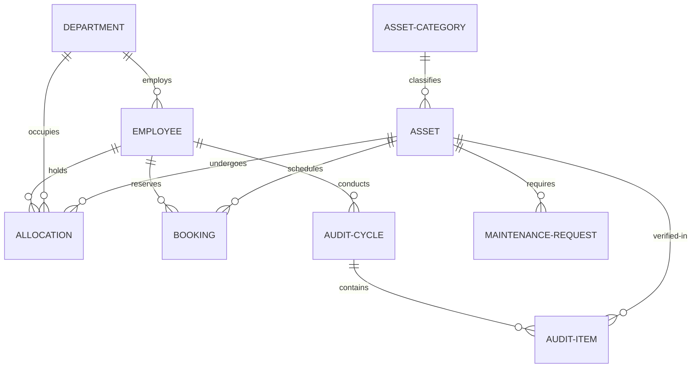

# AssetFlow — Enterprise Asset & Resource Management System

> A centralized ERP platform built with Next.js, Prisma, and React to help organizations track, allocate, audit, and maintain their physical assets and shared resources.

---

## What is AssetFlow?

Organizations of every shape and size — schools, hospitals, factories, offices, agencies — deal with the same quiet problem: nobody really knows where things are, who has them, or what condition they're in. Spreadsheets fill up, paper logs get lost, and assets quietly slip through the cracks.

AssetFlow fixes that.

It gives your organization a single, structured system for managing the full lifecycle of every asset — from the moment it's registered to the day it's retired or disposed of. Asset managers can register and allocate equipment, department heads can oversee what their teams hold, employees can book shared resources and raise maintenance requests, and auditors can run structured verification cycles that actually close.

The system is intentionally scoped to asset and resource management. It doesn't touch purchasing, invoicing, or accounting. It does one thing and tries to do it well.

---

## Who It's For

AssetFlow is built for any organization that manages physical assets or shared spaces and wants to move beyond manual processes:

- **IT teams** tracking laptops, servers, and peripherals
- **Facilities teams** managing conference rooms, vehicles, and equipment pools
- **HR and admin** maintaining an accurate picture of who holds what
- **Audit and compliance** teams that need a reliable paper trail

---

## Features

### Authentication & Role Management

Signup creates an Employee account — no role selection at registration. Admins promote employees to Department Head or Asset Manager from the Employee Directory. This is the only place roles are assigned, preventing self-elevation.

- Email/password login with JWT-based session management
- Forgot password flow
- All authorization enforced server-side via Next.js Route Handlers and Server Actions

### Dashboard & KPI Overview

Every role sees a real-time operational snapshot   when they log in:

- **KPI cards**: Assets Available, Assets Allocated, Maintenance Today, Active Bookings, Pending Transfers, Upcoming Returns
- Overdue returns (past Expected Return Date) are surfaced separately and highlighted
- Quick actions: Register Asset, Book Resource, Raise Maintenance Request

### Organization Setup (Admin)

Three-tab master data management for everything  else in the system to depend on:

**Departments** — Create, edit, and deactivate departments. Assign Department Heads and optionally nest departments under parent departments to reflect your org structure.

**Asset Categories** — Define categories like Electronics, Furniture, Vehicles, and add optional category-specific fields (e.g., warranty period for Electronics).

**Employee Directory** — Manage the full employee roster with name, email, department, role, and status. Role promotion happens here and only here.

### Asset Registration & Directory

A central register for every asset in your organization:

- Register assets with: name, category, auto-generated Asset Tag (e.g. `AF-0001`), serial number, acquisition date, acquisition cost, condition, location, photo and documents, and a "shared/bookable" flag
- Search and filter by Asset Tag, serial number, QR code, category, status, department, or location
- Full lifecycle status visible per asset
- Per-asset history combining allocation history and maintenance history in a single timeline

### Asset Lifecycle

Assets move through a defined set of states with strict transition rules enforced on the server:

| State | Can Transition To |
|---|---|
| **Available** | Allocated, Reserved, Under Maintenance, Retired |
| **Allocated** | Available, Under Maintenance |
| **Reserved** | Allocated, Available |
| **Under Maintenance** | Available, Retired, Lost |
| **Lost** | Disposed |
| **Retired** | Disposed |
| **Disposed** | *(Terminal — no further transitions)* |

This prevents impossible states and keeps the register reliable.

### Asset Allocation & Transfers

Managing who holds what, with clear conflict rules:

- Allocate an asset to an employee or department, with an optional Expected Return Date
- **Conflict prevention**: If an asset is already allocated, the system blocks re-allocation, shows who currently holds it, and surfaces a Transfer Request button instead
- **Transfer workflow**: Requested → Approved (by Asset Manager or Department Head) → Re-allocated, with history updated automatically
- **Return flow**: Mark returned, capture a condition check-in note, asset status reverts to Available
- Overdue allocations are automatically flagged and surfaced in the Dashboard and Notifications

### Resource Booking

Time-slot booking for shared resources — rooms, vehicles, equipment — with overlap prevention built in:

- Calendar view showing a resource's existing bookings
- **Overlap validation**: Bookings that overlap with an existing reservation are rejected. A request for 9:30–10:30 when the room is booked 9:00–10:00 is blocked; a request for 10:00–11:00 is accepted since it starts exactly as the prior booking ends
- Booking statuses: Upcoming, Ongoing, Completed, Cancelled
- Cancel or reschedule with automatic reminder notifications before a slot starts

### Maintenance Management

Repair requests routed through an approval workflow before any work begins:

- Raise a request: select the asset, describe the issue, set priority, attach a photo
- **Workflow**: Pending → Approved / Rejected (by Asset Manager) → Technician Assigned → In Progress → Resolved
- Asset status automatically moves to Under Maintenance on approval and back to Available on resolution
- Full maintenance history retained per asset

### Asset Audit Cycles

Structured verification instead of ad hoc spot checks:

- Create an Audit Cycle with a defined scope (department or location) and date range
- Assign one or more auditors to the cycle
- Auditors mark each asset as Verified, Missing, or Damaged
- The system auto-generates a discrepancy report for flagged items
- Closing a cycle locks it and updates affected asset statuses (confirmed-missing items move to Lost)
- Full audit history retained per cycle

### Reports & Analytics

Operational insight for managers:

- Asset utilization trends — most-used vs. idle assets
- Maintenance frequency by asset and category
- Assets due for maintenance or approaching end-of-life
- Department-wise allocation summary
- Resource booking heatmap showing peak usage windows
- Exportable reports

### Activity Logs & Notifications

A complete record of everything that happens in the system:

- Notifications for: asset assignments, maintenance approvals/rejections, booking confirmations and reminders, transfer approvals, overdue return alerts, audit discrepancy flags
- Full audit log of all admin, manager, and employee actions — who did what and when

---

## Smart Validation & Edge Cases Handled

Enterprise software requires strict business rules. AssetFlow handles several critical edge cases out-of-the-box:

- **The Double-Allocation Shield**: If two managers try to allocate the same physical asset (e.g., a specific vehicle) at the exact same time, the server uses concurrency-safe transactions to resolve the first request and gracefully rejects the second with a clear conflict status.
- **State-Transition Integrity**: An asset marked as `Disposed` or `Retired` can never be transitioned back to `Allocated` or `Available`. This prevents security and accounting fraud.
- **Booking Overlaps Down to the Millisecond**: Booking time-slot checks use non-inclusive boundaries. A booking ending at `10:00` allows the next booking to start exactly at `10:00` without triggering a false conflict.
- **Safe Auditing Loop**: When an audit cycle is closed, the system only updates assets to `Lost` if they were explicitly flagged as `Missing`. It preserves histories and prevents bulk corruption.

---

## Security & Data Hardening

AssetFlow is architected with a security-first approach to protect sensitive organizational rosters and asset histories:

- **JWT Role Enforcement**: Decoding and authorization happen entirely on the server. If a client attempts to bypass the UI to call backend promotion APIs or access Admin-only pages, Next.js Middleware and Server Actions reject the request with a `403 Forbidden` response.
- **Cryptographic Protections**: All employee passwords are salted and hashed using `bcryptjs` before storage. Plain-text passwords never touch the database.
- **Immutable Log Trails**: High-privilege actions (like role promotions, asset disposals, and audit lockouts) are logged to an append-only log in the database that cannot be modified or cleared via standard API endpoints.
- **Input Sanitization**: All incoming parameters are validated using `zod` schema verification to prevent script injections and malformed payloads.

---

## Database Entity Relationships

Even though the system runs on a lightweight JSON document store, it maintains clear relational integrity:



---

## User Roles

| Role | Responsibilities |
|---|---|
| **Admin** | Organization setup (departments, categories, employee directory, role promotion), system-wide analytics, audit cycle management |
| **Asset Manager** | Register and allocate assets, approve transfers and maintenance requests, manage returns and condition check-ins |
| **Department Head** | View department assets, approve allocation and transfer requests within their department, book shared resources on behalf of the department |
| **Employee** | View assigned assets, book shared resources, raise maintenance requests, initiate returns and transfer requests |

---

## How It Works — A Typical Flow

1. **Admin** sets up departments, asset categories, and promotes selected employees to Department Head and Asset Manager.
2. **Asset Manager** registers a new asset. It enters the system as Available.
3. The asset is allocated to an employee or department. If it's already taken, the system blocks the allocation and prompts a transfer request instead. Shared resources can be flagged as bookable.
4. **Employees** book shared resources by time slot. Overlapping requests are automatically rejected.
5. When an asset needs repair, the holder raises a maintenance request. It must be approved before work begins — approval is what flips the status to Under Maintenance.
6. Assets are transferred or returned as needs change. Overdue returns are flagged automatically.
7. **Periodic audit cycles** assign auditors to verify assets across a scope, auto-generate discrepancy reports, and close cleanly — locking the cycle and updating statuses.
8. All activity flows through notifications, logs, and reports.

---

## System Architecture

```
               ┌─────────────────────────────────────────┐
               │            Browser Frontend             │
               │     (Next.js React Client Components)   │
               └─────────────────────────────────────────┘
                                    │
                                    │  API Requests / Server Actions
                                    ▼
               ┌─────────────────────────────────────────┐
               │          Next.js Server & APIs          │
               │   Route Handlers · Server Components    │
               └──────────┬────────────────┬─────────────┘
                          │                │
               [JWT Auth Helper]   [Zod Schemas + Middlewares]
               Verify tokens &     Validate inputs & permissions
               extract user roles
                          │                │
                          └────────┬───────┘
                                   │
               ┌─────────────────────────────────────────┐
               │            Prisma ORM Client            │
               │        Transaction & State Guards       │
               └─────────────────────────────────────────┘
                                   │
               ┌─────────────────────────────────────────┐
               │          Database (SQLite/Postgres)     │
               └─────────────────────────────────────────┘
```

---

## Tech Stack

| Layer | Technology |
|---|---|
| **Framework** | Next.js (App Router, React Server Components, Server Actions) |
| **Language** | TypeScript / JavaScript ES6+ |
| **Database ORM** | Prisma ORM |
| **Database** | SQLite (for simple, file-based setup) or PostgreSQL (for production) |
| **Auth & Security** | `jsonwebtoken`, `bcryptjs` |
| **Validation** | `zod` schema validation |
| **Styling** | Tailwind CSS (Modern dark-mode, glassmorphism, responsive grid) |
| **Charts** | Chart.js or Recharts |

---

## Project Structure

```
AssetManagementSystem/
├── prisma/
│   └── schema.prisma   # Prisma schema file mapping tables and relations
├── src/
│   ├── app/            # App router pages, layouts, and api handlers
│   │   ├── api/        # Next.js API route handlers
│   │   ├── layout.tsx  # Application layout shell
│   │   └── page.tsx    # Dashboard & route controller
│   ├── components/     # Reusable UI component library (sidebar, charts, cards)
│   ├── lib/            # Server utilities (Prisma client, JWT token operations, validation)
│   └── types/          # Shared typescript interfaces
├── package.json        # Dependencies and dev scripts
├── tailwind.config.ts  # Tailwind style rules and design system colors
└── tsconfig.json       # TypeScript configuration
```

---

## Getting Started

### Prerequisites

- [Node.js](https://nodejs.org/) v18.17 or later
- npm v9 or later

### 1. Clone and Install

```bash
git clone <repository-url> AssetManagementSystem
cd AssetManagementSystem
npm install
```

### 2. Set Up Database

Run the database schema setup using Prisma (generates a local SQLite file automatically):

```bash
npx prisma db push
```

To view or edit the database directly through a GUI:
```bash
npx prisma studio
```

### 3. Start the Server

Start the development server with hot-reloading:

```bash
npm run dev
```

Open **`http://localhost:3000`** in your browser.

---

## Demo Accounts

A role switcher in the UI lets you jump between accounts without re-entering credentials. Each click makes a real authentication request — nothing is bypassed.

| Name | Role | Email | Password |
|---|---|---|---|
| Sarah Jenkins | Admin | `admin@assetflow.com` | `Demo@123` |
| Marcus Vance | Asset Manager | `manager@assetflow.com` | `Demo@123` |
| Elena Rostova | Department Head (IT) | `elena.it@assetflow.com` | `Demo@123` |
| David Kim | Employee | `david@assetflow.com` | `Demo@123` |
| Priya Patel | Employee | `priya@assetflow.com` | `Demo@123` |

---

## API Reference

### Authentication

| Method | Endpoint | Description |
|---|---|---|
| `POST` | `/api/auth/signup` | Register a new user (defaults to Employee role) |
| `POST` | `/api/auth/login` | Authenticate and receive a signed JWT |
| `POST` | `/api/auth/forgot-password` | Initiate a password reset |

### Organization & Personnel

| Method | Endpoint | Description |
|---|---|---|
| `GET` | `/api/departments` | Retrieve department hierarchy |
| `POST` | `/api/departments` | Create a department (Admin only) |
| `GET` | `/api/employees` | List all employees |
| `POST` | `/api/employees/:id/promote` | Promote an employee's role (Admin only) |

### Assets

| Method | Endpoint | Description |
|---|---|---|
| `GET` | `/api/assets` | List assets — filterable by category, department, location, status, tag |
| `POST` | `/api/assets` | Register a new asset with photo upload (Asset Manager only) |
| `GET` | `/api/assets/:id/history` | Full combined timeline — allocations, maintenance, movements |

### Allocations & Bookings

| Method | Endpoint | Description |
|---|---|---|
| `POST` | `/api/allocations` | Allocate an asset (blocked if not Available) |
| `POST` | `/api/allocations/:id/return` | Return an asset with condition check-in notes |
| `POST` | `/api/transfers` | Request an asset transfer between users or departments |
| `POST` | `/api/bookings` | Book a shared resource (blocked on time overlap) |

### Maintenance

| Method | Endpoint | Description |
|---|---|---|
| `POST` | `/api/maintenance` | Raise a maintenance request |
| `PUT` | `/api/maintenance/:id/status` | Advance workflow state (triggers asset status updates) |

### Audits & Reports

| Method | Endpoint | Description |
|---|---|---|
| `POST` | `/api/audits` | Create an audit cycle (Admin only) |
| `POST` | `/api/audits/:id/items` | Mark audit item status (assigned auditor only) |
| `POST` | `/api/audits/:id/close` | Close cycle, generate discrepancy report, transition missing assets (Admin only) |
| `GET` | `/api/reports` | Utilization charts, maintenance heatmaps, category breakdowns |

---

## Design

The UI is built around a modern, flat, high-density ERP design layout. It uses solid dark charcoal surfaces (`#121214`) on a deep dark zinc background (`#09090b`), separated by clean 1px solid dark gray borders (`#27272a`). All glassmorphism, transparent elements, backdrop blurs, and background gradients are avoided. Main navigation adjusts dynamically based on the user's role, and data tables use compact padding for high scannability. Analytics are rendered with clean, high-contrast layouts.

---

## Future Roadmap

Planned enhancements to turn AssetFlow into a fully-featured enterprise ecosystem:

1. **Native Barcode & QR Scanner Integration**: Allow field agents to scan physical asset labels using their mobile device's camera to instantly view histories or perform check-ins.
2. **Third-Party Notifications**: Push alerts for overdue returns, maintenance approvals, and booking reminders directly to Slack, Microsoft Teams, or email.
3. **Predictive Maintenance Scheduling**: Analyze historical breakdown frequencies to automatically generate preventative maintenance tasks before an asset fails.
4. **Offline Sync**: Enable auditors working in remote locations/warehouses with poor connectivity to perform audit cycles offline and sync changes once back online.

---

## Mockup / POC

Visual wireframes for the full application are available at:
[Excalidraw Mockup](https://app.excalidraw.com/l/65VNwvy7c4X/5ceOBMjbDby)

---

## License

MIT
